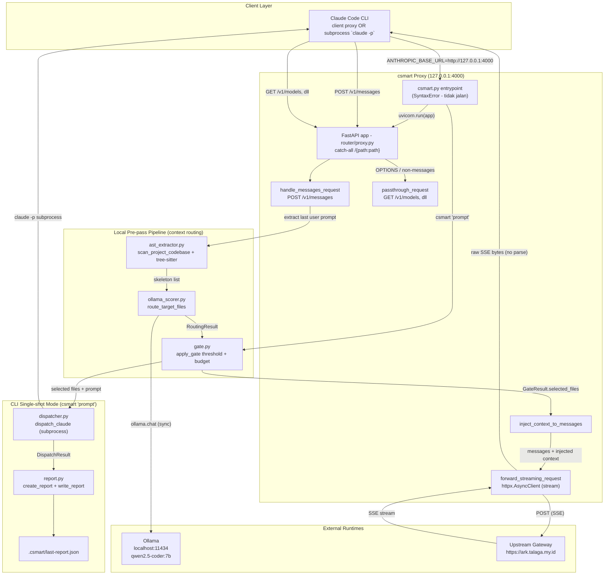
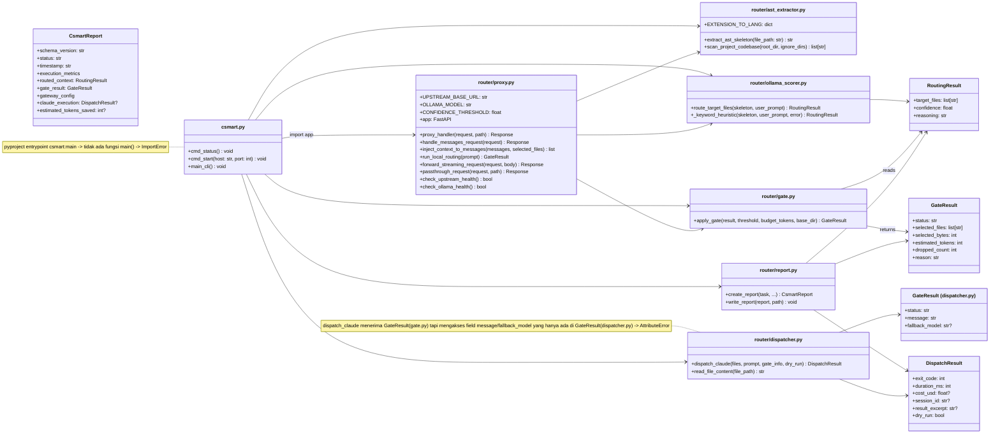
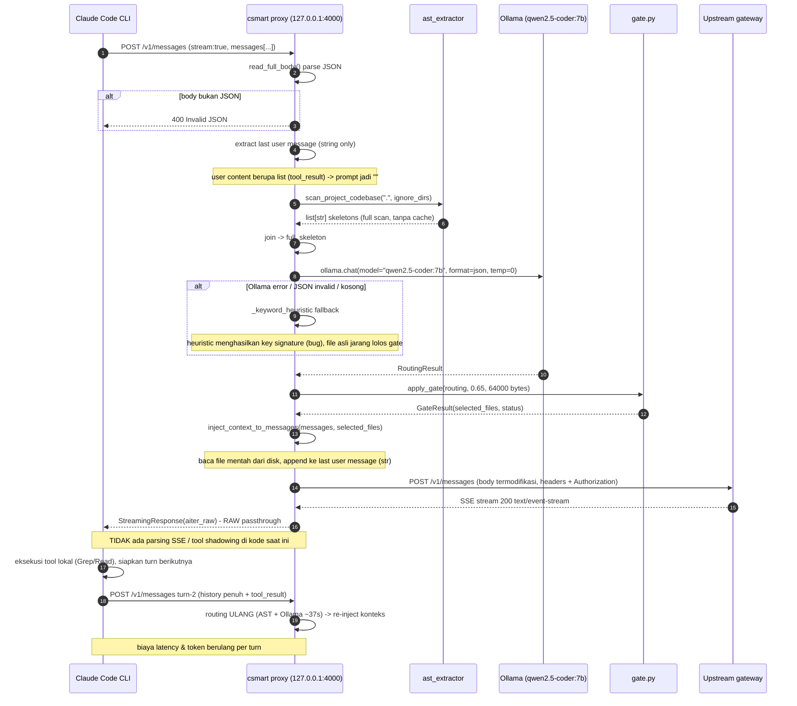
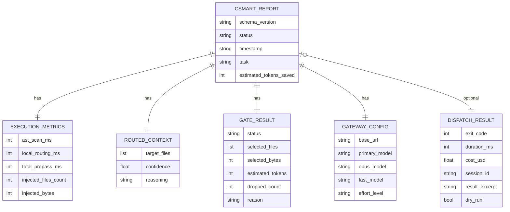
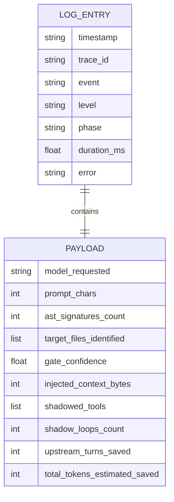

# CODEBASE_ANALYSIS.md — csmart v1.0 (Audit Kondisi Saat Ini)

> **Dokumen**: Architectural & Security Audit — kondisi kode **saat ini** (baseline).
> **Tanggal audit**: 2026-08-27 · **Repo**: `/Volumes/Xugab/LAB/Tria/hemat-token-router` · **Git**: belum di-inisialisasi (tidak ada `.git`)
> **Metode**: pembacaan langsung seluruh file source + tests + ADR, verifikasi runtime (syntax check via `py_compile`).
> **Tujuan**: menjadi baseline objektif untuk dibandingkan dengan target arsitektur refactor (`arsitektur/arsitektur.md`).

---

## Ringkasan Eksekutif (TL;DR)

Project `csmart` adalah **token-optimized proxy/routing** dengan 2 mode: (1) **CLI single-shot** — scan AST → routing Ollama → dispatch ke `claude -p`; (2) **FastAPI reverse proxy** `127.0.0.1:4000` — intercept `POST /v1/messages`, inject konteks terpilih, forward ke upstream gateway, stream balik.

**Temuan kunci:**

| # | Severity | Temuan | Lokasi |
|---|----------|--------|--------|
| F-01 | 🔴 P0 | **`csmart.py` tidak bisa di-parse** — `SyntaxError: unterminated string literal` di fungsi `cmd_status()` → seluruh entrypoint (CLI + proxy mode) mati | `csmart.py:27-28` |
| F-02 | 🔴 P0 | **Console script `csmart = "csmart:main"` menunjuk fungsi yang tidak ada** (hanya ada `main_cli`) → `csmart` command hasil `pip install` langsung `ImportError` | `pyproject.toml:21`, `csmart.py` |
| F-03 | 🟠 P1 | **Subcommand `csmart start`/`status` tidak pernah tercapai** — dua positional optional (`prompt` lalu `command`) → `csmart start` ter-parse sebagai prompt | `csmart.py:69-75,132-138` |
| F-04 | 🟠 P1 | **`import json` hilang** di top-level; dipakai di path `gate_blocked` → `NameError` saat strict mode | `csmart.py:199` |
| F-05 | 🟠 P1 | **`--timeout` CLI tidak pernah diteruskan** ke `dispatch_claude`; `subprocess.run` tanpa `timeout` → bisa hang selamanya | `csmart.py:227`, `dispatcher.py:39,121` |
| F-06 | 🟠 P1 | **Dual class `GateResult`** — `dispatch_claude` akses `gate_info.message` padahal pipeline mengirim `GateResult` (gate.py) yang hanya punya `reason` → `AttributeError` di path fallback/blocked | `gate.py:13`, `dispatcher.py:20,69` |
| F-07 | 🟠 P1 | **Routing dijalankan ulang di SETIAP turn** — AST scan full-tree + Ollama sync blocking (~37s) di dalam event loop ASGI; multi-turn conversation = delay + re-inject konteks berulang | `proxy.py:79-90,133` |
| F-08 | 🟠 P1 | **Fitur inti target v2.0 belum ada**: tidak ada `logger.py`, `tool_shadow.py`, SSE parsing, maupun tool shadowing — proxy murni passthrough | `router/` |
| F-09 | 🟠 P1 | **Path read model-controlled tanpa validasi** — `target_files` dari Ollama (untrusted) dibuka langsung oleh proxy → potensi path traversal/arbitrary file read | `proxy.py:50-54`, `gate.py:71` |
| F-10 | 🟠 P1 | **Test proxy tidak hermetic** — memanggil Ollama live + upstream nyata (network dependency) | `tests/test_proxy.py:19-37` |

**Bottom line**: struktur modular (pipeline pattern) sudah benar dan testable, tetapi **entrypoint tidak bisa jalan sama sekali**, ada beberapa bug runtime di path CLI, dan seluruh **observability/tool-shadowing yang dijanjikan arsitektur v2.0 belum diimplementasikan**. Ini bukan "refactor", melainkan **menyelesaikan + merekonstruksi** menuju target.

---

## Bagian 1: High-Level System Architecture (Macro Topology)

### 1.1 Peran komponen

| Komponen | Peran | Mode |
|---|---|---|
| `csmart.py` | CLI entrypoint + orkestrasi pipeline | CLI & Proxy |
| `router/proxy.py` | FastAPI ASGI reverse proxy (`127.0.0.1:4000`) | Proxy |
| `router/ast_extractor.py` | Ekstraksi skeleton (signature) via tree-sitter | Keduanya |
| `router/ollama_scorer.py` | Routing target file via Ollama `qwen2.5-coder:7b` + fallback keyword | Keduanya |
| `router/gate.py` | Confidence threshold + token budget cap | Keduanya |
| `router/dispatcher.py` | Dispatch `claude -p` subprocess (CLI mode) | CLI |
| `router/report.py` | Skema + serialisasi JSON report | CLI |
| Ollama local | Runtime LLM lokal `127.0.0.1:11434` | Eksternal |
| Upstream gateway | `https://ark.talaga.my.id` (Anthropic-compatible) | Eksternal |
| Claude Code CLI | Client proxy (`ANTHROPIC_BASE_URL=127.0.0.1:4000`) / subprocess | Eksternal |

### 1.2 Topologi makro



**Catatan arsitektural:**
- **Dua mode berbagi prepass** (AST → scorer → gate) tetapi **tidak berbagi executor** (proxy memakai httpx ke upstream; CLI memakai subprocess `claude -p`).
- `dispatcher.py` dan `report.py` **hanya dipakai di mode CLI** — tidak ada di alur proxy.
- Tidak ada logging/telemetry terstruktur di kode saat ini (modul `logger.py` belum ada).

---

## Bagian 2: Low-Level Component Design & Interface Contracts

### 2.1 Pydantic models / DTO (fakta dari kode)

| Model | Modul | Fields | Keterangan |
|---|---|---|---|
| `RoutingResult` | `ollama_scorer.py:8-11` | `target_files: list[str]`, `confidence: float`, `reasoning: str` | Output routing; confidence global (per-file tidak ada) |
| `GateResult` | `gate.py:13-21` | `status: str`, `selected_files: list[str]`, `selected_bytes: int`, `estimated_tokens: int`, `dropped_count: int`, `reason: str` | Digunakan pipeline |
| `GateResult` ⚠️ | `dispatcher.py:20-24` | `status: str`, `message: str`, `fallback_model: str?` | **Duplikat nama, schema beda** → sumber bug |
| `DispatchResult` | `dispatcher.py:10-17` | `exit_code: int`, `duration_ms: int`, `cost_usd: float?`, `session_id: str?`, `result_excerpt: str?`, `dry_run: bool` | Output dispatch CLI |
| `ExecutionMetrics` | `report.py:18-24` | `ast_scan_ms`, `local_routing_ms`, `total_prepass_ms`, `injected_files_count`, `injected_bytes` | Metrik report |
| `GatewayConfig` | `report.py:27-33` | `base_url`, `primary_model`, `opus_model`, `fast_model`, `effort_level` | Dari env |
| `CsmartReport` | `report.py:36-47` | `schema_version="1.0"`, `status`, `timestamp`, `task`, `execution_metrics`, `routed_context`, `gate_result`, `gateway_config`, `claude_execution?`, `estimated_tokens_saved?` | Report final |

> ADR-2 merekomendasikan `router/models.py` sebagai kontrak bersama, **tapi file tersebut tidak ada** — kontrak tersebar/duplikat di tiap modul.

### 2.2 Class & function signature utama



### 2.3 Kontrak antar-stage (alur data)

```
scan_project_codebase(".", IGNORE_DIRS) ──► list[str] skeletons
        │
        ▼
"\n".join(skeletons)  ──►  route_target_files(full_skeleton, prompt)
                                    │  qwen2.5-coder:7b (sync, hardcoded)
                                    ▼
                            RoutingResult(target_files, confidence, reasoning)
                                    │
                                    ▼
                  apply_gate(routing, threshold=0.65, budget=16000*4)
                                    │  budget_bytes = budget_tokens * 4
                                    ▼
                       GateResult(status, selected_files, ...)
                                    │
              ┌─────────────────────┴──────────────────────┐
              ▼                                            ▼
   [Proxy] inject_context_to_messages        [CLI] dispatch_claude(files, prompt, gate_info)
              ▼                                            ▼
      forward_streaming_request                     DispatchResult ──► CsmartReport
              ▼                                            ▼
      upstream (SSE)                                write_report(.csmart/last-report.json)
```

**Konstanta & env (fakta):**
| Konstanta | Nilai | Lokasi |
|---|---|---|
| `CONFIDENCE_THRESHOLD` | `0.65` (env `CSMART_THRESHOLD`) | `proxy.py:23` |
| `DEFAULT_BUDGET_TOKENS` | `16000` (env `CSMART_BUDGET`) | `proxy.py:24` |
| `UPSTREAM_BASE_URL` | env `ANTHROPIC_UPSTREAM_URL` → `https://ark.talaga.my.id` | `proxy.py:21` |
| Model Ollama | **hardcoded** `qwen2.5-coder:7b` di scorer (env `OLLAMA_MODEL` di proxy tidak pernah dipakai) | `ollama_scorer.py:55` |
| Estimasi token | `bytes // 4` (4 byte/token) | `gate.py:54`, `csmart.py:171` |

---

## Bagian 3: End-to-End Inbound & Outbound Execution Flow

### 3.1 Flow `POST /v1/messages` saat ini



### 3.2 Detail transformasi payload per stage

| Stage | Input → Output | Catatan bug/fakta |
|---|---|---|
| Body parse | raw bytes → `dict` | Tanpa size limit; body non-JSON → 400 |
| Extract prompt | `messages[]` → `str` | **Hanya content string**; content list (tool_result) diabaikan → prompt kosong (`proxy.py:127-131`) |
| AST scan | `.` dir → `list[str]` | Full `os.walk` tiap request; skip dir via `IGNORE_DIRS`; max 12 signature/file |
| Ollama scoring | skeleton + prompt → `RoutingResult` | **Sync blocking**; hardcoded model; fallback ke heuristic saat error |
| Gate | `RoutingResult` → `GateResult` | Whole-file drop (tidak truncate mid-file); file yang tidak exist di-skip |
| Context injection | messages + selected_files → messages | **Baca file mentah via `open(file_path)`**; append hanya ke user message string terakhir |
| Forward | body → upstream | Copy semua header kecuali `host`/`content-length`; **tanpa timeout, tanpa retry** |
| Response | SSE bytes → client | **`aiter_raw()` mentah** — tidak diparse, tidak di-scan |

---

## Bagian 4: Tool Shadowing & Sub-Agent Exploration Loop

### 4.1 Status implementasi (fakta)

| Fitur shadowing | Status | Bukti |
|---|---|---|
| Parser SSE | ❌ Tidak ada | `forward_streaming_request` langsung `aiter_raw()` (`proxy.py:170-176`) |
| Deteksi `tool_use` | ❌ Tidak ada | Tidak ada logika `content_block_start`/`partial_json` |
| `router/tool_shadow.py` | ❌ File tidak ada | `ls router/` |
| Eksekusi lokal (Grep/Glob/View) | ❌ Tidak ada | — |
| Summarizer Qwen | ❌ Tidak ada | — |
| Re-submit internal `tool_result` | ❌ Tidak ada | — |
| `router/logger.py` (telemetry) | ❌ File tidak ada | `ls router/` |

**Kesimpulan**: seluruh **Outbound Exploration Shadowing** dari arsitektur v2.0 **belum diimplementasikan**. Alur saat ini: proxy murni meneruskan SSE byte-per-byte; eksekusi tool & loop percakapan sepenuhnya milik Claude Code CLI.

### 4.2 Target desain shadow loop (dari `arsitektur/arsitektur.md` — belum ada di kode)

```mermaid
stateDiagram-v2
    [*] --> INBOUND: POST /v1/messages
    INBOUND --> PREPASS: AST + Ollama + gate
    PREPASS --> UPSTREAM: inject context
    UPSTREAM --> PARSE: SSE chunks
    state PARSE {
        [*] --> TEXT: content_block_delta
        [*] --> TOOL: content_block_start tool_use
        TEXT --> FORWARD: stream ke client real-time
        TOOL --> DECIDE
        DECIDE --> FORWARD: Edit/Write/unknown -> passthrough
        DECIDE --> LOCAL: tool eksplorasi (Grep/Glob/View/LS/read_file)
        LOCAL --> SUMMARY: run di disk lokal
        SUMMARY --> RESUBMIT: tool_result ringkas via Qwen
        RESUBMIT --> PARSE: re-submit internal (loop bounded)
        FORWARD --> [*]
    }
    PARSE --> DONE: SSE_STREAM_COMPLETE
    DONE --> LOG: metrics + tokens saved
    LOG --> [*]
```

### 4.3 Risiko desain shadowing (harus diselesaikan sebelum implementasi)

| Risiko | Penjelasan |
|---|---|
| **SSE reassembly** | `tool_use` tersebar: `content_block_start` (bawa `id`+`name`) → `content_block_delta` (`partial_json`) → `content_block_stop`. Chunk TCP bisa memotong event — butuh parser SSE + akumulasi JSON |
| **Loop bound** | Re-submit internal tanpa cap = infinite loop jika model minta tool terus |
| **Parallel tool_use** | Satu response bisa punya banyak blok tool_use paralel |
| **State drift** | Proxy menyembunyikan event dari client → history client vs proxy tidak sinkron |
| **Fallback** | Jika exec lokal / Ollama gagal → harus passthrough tool_use asli, jangan hang |
| **Metric `upstream_turns_saved`** | Secara konsep salah: re-submit tetap satu turn upstream. Yang dihemat **token** (tool_result diringkas), bukan turn |

> Alternatif yang lebih robust: **Claude Code hooks** (`PreToolUse`/`PostToolUse`) — intercept eksekusi tool di sisi harness tanpa MITM HTTP. Detail di Bagian 7 roadmap.

---

## Bagian 5: Telemetry, Structured Logging & Metrics Model

### 5.1 Fakta saat ini

- **Tidak ada modul logging terstruktur.** Tidak ada `logger.py`, tidak ada `logging` call di `proxy.py`/`csmart.py`/`router/*`. Satu-satunya artefak observability adalah report JSON **per-run CLI** (`.csmart/last-report.json`).
- Proxy mode: **nol observability runtime** — tidak ada trace_id, tidak ada event log, tidak ada metrik.

### 5.2 Skema report saat ini (fakta dari `report.py`)



### 5.3 Target schema log JSONL (dari `arsitektur.md` — belum ada di kode)



### 5.4 Masalah metrik pada kode saat ini

| Masalah | Detail |
|---|---|
| `estimated_tokens_saved` salah | `report.py:78-83`: `int((injected_bytes * 4) // 4)` = `injected_bytes` (label token, isi bytes). Komentar mengakui "we don't know full context size" |
| Tidak ada metrik biaya di proxy | DispatchResult punya `cost_usd`/`session_id` tapi hanya untuk mode CLI |
| Tanda `--json` vs file report | File selalu ditulis, `--json` hanya stdout (ADR-5 ✓) — tapi path strict mode pakai `json.dump` manual (F-04) |

---

## Bagian 6: Security, Error Handling & Failure Modes

### 6.1 Penanganan credential (fakta)

| Aspek | Kondisi | Severity |
|---|---|---|
| Token auth | Header `Authorization` dari client **diteruskan apa adanya** ke upstream (`proxy.py:151-156`) | — (fungsi inti) |
| Hardcoded path credential | `dispatcher.py:87`: `/Volumes/Xugab/LAB/PrivateLink/credentials/.env` — path absolut machine-specific; nilai token tidak pernah di-log (baik) | 🟡 |
| `load_dotenv` default | `override=False` → nilai env yang sudah ada di shell menang atas `.env` (perilaku bergantung shell) | 🟡 |
| Proxy tanpa auth | Siapa pun di mesin yang bisa `POST 127.0.0.1:4000` = **relay token upstream gratis** (pakai quota user). Loopback membatasi ke mesin lokal saja | 🟡 P2 |
| Header forwarding broad | Semua header kecuali `host`/`content-length` ikut (cookie, `x-api-key`, dll) | 🟡 P2 |

### 6.2 Failure modes & fallback (alur)

```mermaid
flowchart TD
    START([POST /v1/messages]) --> BODY{body valid JSON?}
    BODY -- "tidak" --> R400[400 Invalid JSON]
    BODY -- "ya" --> SCAN
    SCAN --> PARSEF{tree-sitter parse?}
    PARSEF -- "error/gagal" --> SKIP[skip file -> skeleton kosong]
    PARSEF -- "ok" --> OLL{ollama.chat berhasil?}
    OLL -- "error / JSON invalid / timeout" --> HEUR[fallback _keyword_heuristic]
    OLL -- "ok" --> ROUTE
    HEUR --> ROUTE[RoutingResult diperoleh]
    ROUTE --> GATE{confidence >= 0.65?}
    GATE -- "tidak" --> STRICT{strict mode?}
    STRICT -- "ya (CLI)" --> EXIT2[exit 2 - report gate_blocked]
    STRICT -- "tidak" --> EMPTY[inject 0 file -> passthrough tanpa konteks]
    GATE -- "ya" --> BUDGET{budget cukup?}
    BUDGET -- "tidak" --> PARTIAL[inject file yang muat (fallback)]
    BUDGET -- "ya" --> INJECT[inject selected files]
    INJECT --> FWD{upstream reachable?}
    FWD -- "connection error / timeout" --> ERR500[500 polos - tidak ada retry, stream setengah terbuka]
    FWD -- "ok" --> SSE[stream SSE raw]
    EMPTY --> FWD
    PARTIAL --> FWD
```

### 6.3 Detail failure mode per komponen

| Komponen | Kegagalan | Perilaku saat ini | Penilaian |
|---|---|---|---|
| Ollama offline | `ollama.chat` raise | Caught → heuristic fallback ✓ tidak crash | ✅ graceful |
| Ollama hang (load model) | Sync blocking di event loop | Semua request proxy ikut macet | 🔴 blocking |
| Tree-sitter parse rusak | Exception dalam `extract_ast_skeleton` | Caught → return `""` → file dilewati ✓ | ✅ defensive |
| Upstream connection error / timeout | `httpx` raise | Exception propagates → FastAPI 500; **tidak ada retry** | 🔴 fragile |
| Upstream 401/403 | Response error | Diteruskan ke client apa adanya ✓ | ✅ |
| Ollama JSON invalid | `json.loads` gagal | Caught → heuristic ✓ | ✅ |
| Gate blocked | Confidence < threshold | CLI strict: exit 2. CLI non-strict / proxy: dispatch tanpa konteks | ✅ by design |
| File hilang / tidak exist | `os.path.exists` false | Di-skip di gate ✓ | ✅ |

### 6.4 Temuan keamanan (analisis)

1. **F-09 — Path read model-controlled (P1)**: `target_files` berasal dari output Ollama (prompt-influenced), lalu `inject_context_to_messages` membaca file itu via `open(file_path)` (`proxy.py:50-54`). Path seperti `../../../../etc/passwd` tidak divalidasi terhadap repo root → **arbitrary file read** yang isinya dikirim ke upstream. Butuh canonical-path whitelist (`Path.resolve().is_relative_to(root)`).
2. **Relay credential (P2)**: proxy tanpa auth, token upstream langsung diteruskan. Loopback mereduksi risiko, tapi proses lokal lain (atau extension/malware) bisa menyalahgunakan.
3. **Header forwarding broad (P2)**: filter hanya `host`/`content-length`. Sebaiknya whitelist header yang memang dibutuhkan.
4. **Tidak ada size limit body (P2)**: `read_full_body` memuat seluruh body ke memori tanpa cap.
5. **Token tidak pernah di-log** ✅ (kode saat ini memang tanpa logging sama sekali — di target v2.0, pastikan payload log **tidak** menyertakan prompt/Authorization).

---

## Bagian 7: Gap Analysis & Actionable Roadmap

### 7.1 Perbandingan: kondisi saat ini vs target arsitektur v2.0

| Dimensi | Saat Ini (v1.0) | Target (`arsitektur.md`) | Gap |
|---|---|---|---|
| Entry | CLI + proxy (keduanya **rusak**) | Proxy `127.0.0.1:4000` sebagai primer | Rekonstruksi |
| Inbound pre-pass | Ada (AST + Ollama + gate + inject) | Ada + telemetry | Telah ada, tinggal log |
| Outbound shadowing | ❌ Tidak ada (raw passthrough) | Intercept tool eksplorasi, exec lokal, summarize, re-submit | Implementasi penuh |
| Structured logging | ❌ Tidak ada | JSONL ke `~/.csmart/logs/` | Implementasi (`logger.py`) |
| CLI viewer | ❌ Tidak ada | `csmart start/logs/stats` | Implementasi |
| Tests | AST + gate (hermetic); **proxy tidak hermetic** | + `test_logger`, `test_tool_shadow`, `test_proxy_server` | Lengkapi |
| QG-02 latency ≤1.8s | Realita `local_routing_ms: 37621` (~37s) | Threshold 1.8s | Butuh cache + async + routing sekali per sesi |

### 7.2 Temuan lengkap & prioritas perbaikan

| ID | Severity | Temuan | Lokasi | Rekomendasi |
|---|---|---|---|---|
| F-01 | 🔴 P0 | `SyntaxError` (unterminated string) di `cmd_status` — modul tak bisa di-parse | `csmart.py:27-28` | Perbaiki quote literal `'...'` di dalam f-string |
| F-02 | 🔴 P0 | Entrypoint `csmart:main` menunjuk fungsi tak ada | `pyproject.toml:21` | Ubah ke `csmart:main_cli` atau definisikan `main()` |
| F-03 | 🟠 P1 | `csmart start`/`status` ter-parse sebagai prompt (2 positional optional) | `csmart.py:69-75,132-138` | Gunakan `subparsers` untuk `start`/`status`, pisah dari positional `prompt` |
| F-04 | 🟠 P1 | `json` tidak di-import; `NameError` di path strict gate_blocked | `csmart.py:199` | `import json` di top-level |
| F-05 | 🟠 P1 | `--timeout` tak diteruskan; `subprocess.run` tanpa timeout | `csmart.py:227`, `dispatcher.py:121` | Tambah param `timeout` → `subprocess.run(..., timeout=timeout_s)` |
| F-06 | 🟠 P1 | Dual `GateResult` → `AttributeError: gate_info.message` di fallback/blocked | `gate.py:13`, `dispatcher.py:20,69` | Satu skema; hapus yang duplikat (anti-dual-path) |
| F-07 | 🟠 P1 | Routing ulang per turn: AST full-scan + Ollama sync ~37s di event loop | `proxy.py:79-90,133` | `asyncio.to_thread`, cache AST, routing sekali per sesi (skip turn lanjutan) |
| F-08 | 🟠 P1 | Fitur inti v2.0 belum ada (logger, tool_shadow, SSE parse) | `router/` | Implementasi sesuai roadmap 7.3 |
| F-09 | 🟠 P1 | Path read model-controlled tanpa validasi (path traversal) | `proxy.py:50-54`, `gate.py:71` | Validasi `resolve().is_relative_to(root)` sebelum read |
| F-10 | 🟠 P1 | Test proxy bergantung Ollama + upstream live (tidak hermetic) | `tests/test_proxy.py:19-37` | Mock httpx transport + mock scorer; pisahkan integration test |
| F-11 | 🟡 P2 | Heuristic confidence cap 0.8 (ADR-3 bilang 0.5) → bisa lolos threshold 0.65 sebagai "high" | `ollama_scorer.py:152` | Cap 0.5 atau tambah marker `method` ke gate |
| F-12 | 🟡 P2 | `_keyword_heuristic` salah mem-parse skeleton — tiap baris dianggap file path (termasuk `- def foo`) → key sampah, file asli jarang lolos | `ollama_scorer.py:118-137` | Parse blok `// <path>` dengan benar, hanya count keyword per file |
| F-13 | 🟡 P2 | `estimated_tokens_saved` = `injected_bytes` (label token, isi bytes) | `report.py:78-83` | Hitung benar atau set `None` |
| F-14 | 🟡 P2 | `check_upstream_health` anggap `<500` = OK → 401/403 dianggap sehat | `proxy.py:214-222` | Terima hanya `200`/`404` model; uji autentikasi |
| F-15 | 🟡 P2 | `OLLAMA_MODEL` env dead — scorer hardcode `qwen2.5-coder:7b` | `proxy.py:24`, `ollama_scorer.py:55` | Teruskan env ke scorer (satu sumber config) |
| F-16 | 🟡 P2 | `tree-sitter-language-pack` pin `>=0.7.0` unbounded (ADR-1: `<1.0`); **tidak ada dev-group `pytest`** | `pyproject.toml:10-18` | Pin `<1.0`, tambah `[project.optional-dependencies] dev = ["pytest"]` |
| F-17 | 🟡 P2 | Artefak stale di repo: `csmart.egg-info/`, `debug_ast.py`, `debug_interface.js`, `.pytest_cache/` | root | Bersihkan; tambah ke `.gitignore` |
| F-18 | 🟡 P2 | `max_sigs=12` hardcoded; AST scan full-tree tiap request tanpa cache | `ast_extractor.py:95` | Konfigurasi + incremental cache |
| F-19 | 🟡 P2 | Proxy tanpa auth + header forwarding broad | `proxy.py:151-156` | Whitelist header; pertimbangkan token lokal |
| F-20 | 🟡 P2 | Tidak ada size limit body; `read_full_body` baca penuh ke memori | `proxy.py:34-36` | Cap size (mis. 10MB) |

### 7.3 Roadmap implementasi (rekomendasi, berurutan)

| Fase | Isi | Menangani |
|---|---|---|
| **Fase 0 — Resusitasi** | Fix F-01..F-06 (entrypoint jalan, CLI mode benar). Verifikasi `py_compile` + `python csmart.py --dry-run` | P0/P1 crash |
| **Fase 1 — Hygiene & hermetic test** | Fix F-10..F-18. Mock semua eksternal di test; cleanup artefak; pyright clean | P1/P2 quality |
| **Fase 2 — Telemetry** | Implement `router/logger.py` (JSONL thread-safe, trace_id per request), sambung ke `proxy.py` (INBOUND → SSE_STREAM_COMPLETE). Mulai dari alur inbound dulu | F-08 (parsial) |
| **Fase 3 — Proxy performance** | `asyncio.to_thread` untuk prepass, AST cache, routing sekali per sesi (caching by conversation/session), cap body, header whitelist | F-07, F-09, F-19 |
| **Fase 4 — Tool shadowing** | Keputusan arsitektur dulu: **HTTP MITM vs Claude Code hooks**. Rekomendasi: hooks `PreToolUse`/`PostToolUse` untuk shadowing; proxy tetap untuk inbound injection + telemetry. Jika tetap proxy: implement SSE parser + loop bound + fallback + parallel tool_use | F-08 |
| **Fase 5 — CLI viewer & metrics** | `csmart logs --follow`, `csmart stats`, perbaiki metrik token saved, bandingkan vs QG-01..04 | Target v2.0 |

### 7.4 Quality gates yang bisa diverifikasi segera

| Gate | Kriteria | Status sekarang |
|---|---|---|
| `python3 -m py_compile csmart.py` | Tidak ada SyntaxError | ❌ Gagal (F-01) |
| `python csmart.py --dry-run --json "..."` | Report valid, exit 0 | ❌ Tidak bisa jalan |
| `pytest tests/ -v` | Semua hijau | ⚠️ AST+gate hijau; proxy butuh Ollama+network |
| `pyright router/ csmart.py` | Clean | ⚠️ Belum diverifikasi (kemungkinan temuan `GateResult` type mismatch) |

---

## Lampiran: Inventaris File

| File | Ukuran | Peran |
|---|---|---|
| `csmart.py` | 281 baris | Entrypoint CLI + proxy |
| `router/__init__.py` | 0 B (kosong) | — |
| `router/ast_extractor.py` | 148 baris | Tree-sitter AST skeleton |
| `router/ollama_scorer.py` | 160 baris | Ollama routing + heuristic |
| `router/gate.py` | 144 baris | Confidence + budget gate |
| `router/dispatcher.py` | 177 baris | Claude CLI dispatch (CLI mode) |
| `router/proxy.py` | 233 baris | FastAPI reverse proxy |
| `router/report.py` | 102 baris | Skema + serialisasi report |
| `tests/test_ast_extractor.py` | 143 baris | Unit AST ✓ hermetic |
| `tests/test_gate.py` | 126 baris | Unit gate ✓ hermetic |
| `tests/test_proxy.py` | 88 baris | Proxy — ❌ tidak hermetic |
| `tests/__init__.py` | 0 B (kosong) | — |
| `docs/ADR.md` | — | ADR-1..6 + exit codes |
| `debug_ast.py` / `debug_interface.js` | — | Artefak debug stale |
| `csmart.egg-info/`, `.pytest_cache/` | — | Artefak build stale |

**File target v2.0 yang BELUM ada**: `router/logger.py`, `router/tool_shadow.py`, `router/models.py`, `tests/test_logger.py`, `tests/test_tool_shadow.py`.

---

*Dokumen ini adalah snapshot audit kondisi baseline (v1.0). Bandingkan dengan `arsitektur/arsitektur.md` untuk memetakan jarak ke target v2.0.*
