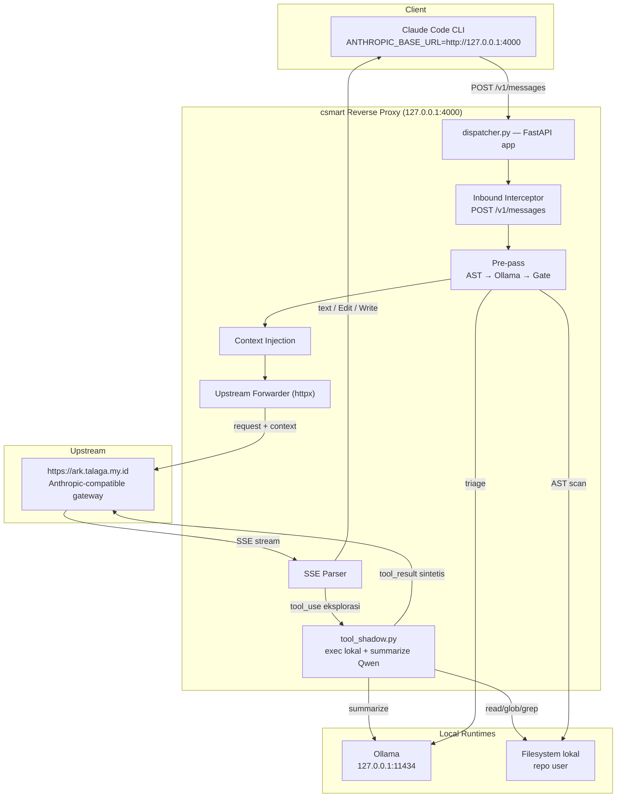
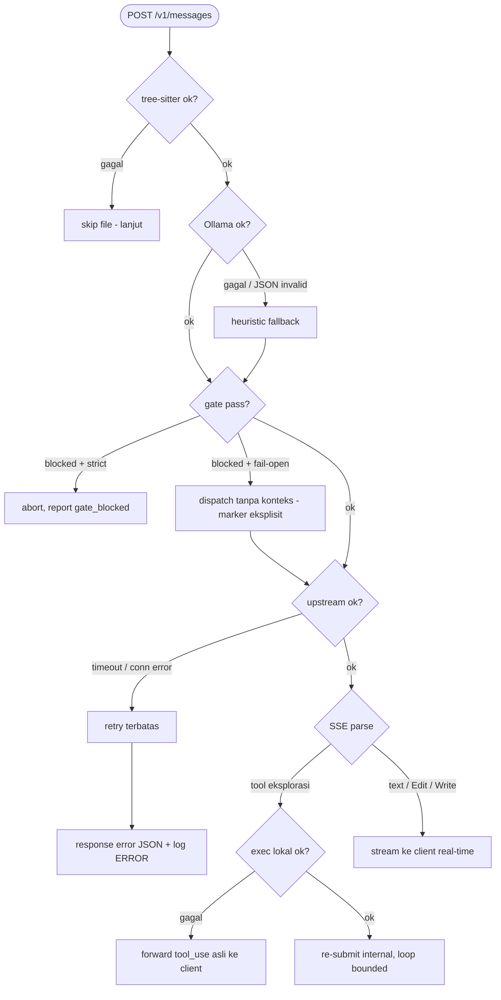

# SDLC Specification v2.0 — csmart: Agentic Reverse Proxy & Local Shadowing

> **Status**: Draft untuk review · **Versi dokumen**: 2.0 · **Tanggal**: 2026-08-27
> **Penulis**: Tim hemat-token-router · **Audience**: AI agent (Claude Code, Cursor), developer, reviewer
> **Dokumen terkait**: `CODEBASE_ANALYSIS.md` (baseline audit), `TASKS.md` (kontrak builder), `docs/ADR.md` (keputusan arsitektur)
> **Prinsip**: Deterministik, terukur, traceable — setiap fase punya *done-when* yang bisa diverifikasi.

---

## Daftar Isi

1. [Executive Summary](#1-executive-summary)
2. [Tujuan, Non-Goals & Metrik Sukses](#2-tujuan-non-goals--metrik-sukses)
3. [Terminologi](#3-terminologi)
4. [Persyaratan Sistem](#4-persyaratan-sistem)
5. [Arsitektur Sistem](#5-arsitektur-sistem)
6. [Kontrak Interface & Data Schemas](#6-kontrak-interface--data-schemas)
7. [Desain Detil Komponen](#7-desain-detil-komponen)
8. [Security Design](#8-security-design)
9. [Error Handling & Failure Modes](#9-error-handling--failure-modes)
10. [Observability & Metrics](#10-observability--metrics)
11. [Rencana Implementasi](#11-rencana-implementasi-phase-by-phase)
12. [Rencana Testing & Verification Matrix](#12-rencana-testing--verification-matrix)
13. [Deployment & Standard Operating Environment](#13-deployment--standard-operating-environment-sop)
14. [Risiko & Mitigasi](#14-risiko--mitigasi)
15. [Open Decisions](#15-open-decisions--item-yang-perlu-dikonfirmasi)
16. [Referensi](#16-referensi)

---

## 1. Executive Summary

`csmart` adalah **HTTP reverse proxy lokal** + **pre-pass cerdas** yang berdiri di antara Claude Code CLI dan upstream gateway. Tujuan inti: **mengurangi token/billable context** dengan memindahkan dua pekerjaan mahal ke runtime lokal:

1. **Inbound pre-pass** — sebelum request dikirim ke upstream, csmart memindai kode (Tree-sitter AST), menyeleksi file yang relevan via LLM lokal (Ollama), lalu **menginjeksi konteks terpilih** ke payload.
2. **Outbound exploration shadowing** — tool eksplorasi (`GrepTool`, `GlobTool`, `View`, `LS`, `read_file`) yang diminta model dieksekusi **di mesin lokal**, hasilnya **diringkas via Qwen lokal**, dan `tool_result` sintetis dikembalikan ke upstream — **tanpa** mengirim output mentah (hemat token konteks).

Semua tahapan wajib mencatat **structured JSON telemetry** (JSONL) untuk observability dan audit biaya.

---

## 2. Tujuan, Non-Goals & Metrik Sukses

### 2.1 Tujuan (Goals)

| ID | Tujuan | Metrik sukses |
|---|---|---|
| G-1 | Hemat token/billable context pada sesi Claude Code | Reduksi token 60–90% untuk codebase besar vs tanpa pre-pass |
| G-2 | Eksekusi tool eksplorasi secara lokal tanpa mengirim output mentah upstream | ≥ 1 tool eksplorasi per sesi di-shadow → `tokens_saved > 0` |
| G-3 | Observability penuh tiap fase | 100% request menghasilkan baris JSONL valid dengan `trace_id` konsisten |
| G-4 | Transparan terhadap klien (Claude Code) | Tidak ada perubahan protokol; SSE tetap valid |
| G-5 | Graceful degradation saat komponen lokal gagal | Ollama offline / AST error → fallback, request tetap jalan |

### 2.2 Non-Goals (di luar scope v2.0)

- Bukan load balancer / proxy untuk banyak user.
- Bukan *agent loop driver* penuh — hanya meng-shadow tool eksplorasi, bukan menggantikan loop Claude Code.
- Tidak menyediakan UI dashboard web; hanya CLI viewer + JSONL.

### 2.3 Key Constraints

| Konstrain | Ketentuan |
|---|---|
| **Network binding** | Reverse proxy hanya di `127.0.0.1:4000` (loopback) |
| **Upstream** | `https://ark.talaga.my.id` (Anthropic-compatible gateway) |
| **Kredensial** | `ANTHROPIC_AUTH_TOKEN` dari `credentials/.env`; **tidak boleh di-log** |
| **Dependency** | `tree-sitter-language-pack` (BUKAN `tree-sitter-languages` — blocker Python 3.14), pin `<1.0` |
| **JSON contract** | Schema field tidak boleh berubah tanpa bump `schema_version` |

---

## 3. Terminologi

| Istilah | Definisi |
|---|---|
| **Pre-pass / prepass** | Pekerjaan lokal sebelum dispatch ke upstream (AST scan → Ollama triage → gate) |
| **Shadowing** | Eksekusi tool eksplorasi di sisi proxy, hasil dikembalikan internal tanpa bocor ke client |
| **Upstream** | Gateway cloud yang melayani `/v1/messages` (Anthropic-compatible) |
| **SSE** | Server-Sent Events — protokol streaming response Claude Code |
| **trace_id** | ID unik per request-turn, konsisten dari inbound sampai stream selesai |
| **Qwen** | Model lokal via Ollama (`qwen2.5-coder:*`) |

---

## 4. Persyaratan Sistem

### 4.1 Functional Requirements

| ID | Requirement | Fase |
|---|---|---|
| FR-1 | Intercept `POST /v1/messages`; ekstrak Macro Context via Tree-sitter | 3 |
| FR-2 | Evaluasi target file via Ollama; injeksi konten target sebelum forward | 3 |
| FR-3 | Parse SSE stream asinkron; deteksi `tool_use` eksplorasi | 3 |
| FR-4 | Eksekusi lokal tool eksplorasi (`GlobTool`, `GrepTool`, `View`, `LS`, `read_file`, `FileRead`) | 2 |
| FR-5 | Ringkas output tool via Qwen lokal; sintesis `tool_result`; re-submit internal | 2, 3 |
| FR-6 | Stream `tool_use` non-eksplorasi (Edit/Write) & text langsung ke client | 3 |
| FR-7 | Catat JSONL terstruktur ke `~/.csmart/logs/` + stdout untuk tiap fase | 1 |
| FR-8 | CLI: `csmart start [--port 4000]`, `csmart logs`, `csmart stats` | 4 |
| FR-9 | Sediakan trace consistency (trace_id dari inbound → SSE complete) | 1, 3 |

### 4.2 Non-Functional Requirements

| ID | Aspek | Requirement | Target |
|---|---|---|---|
| NFR-1 | **Latency prepass** | AST + Ollama triage ≤ 1.8 s (dengan cache + async) | QG-02 |
| NFR-2 | **Streaming fidelity** | Event Edit/Write/text diteruskan real-time, tanpa buffer lag | QG-04 |
| NFR-3 | **Reliability** | Fallback saat Ollama offline / AST error / upstream timeout | QG-01 |
| NFR-4 | **Security** | Tidak ada credential/prompt di log; loopback only; validasi path | §8 |
| NFR-5 | **Isolasi** | Shadow loop bounded (max N re-submit); tidak infinite loop | §9 |
| NFR-6 | **Observability** | Setiap event JSONL lolos validasi schema (Pydantic) | QG-01 |
| NFR-7 | **Performance** | Blok blocking (Ollama/AST) tidak menghentikan event loop | §5.4 |
| NFR-8 | **Konsistensi model** | Satu sumber kebenaran untuk nama model (env, bukan hardcode) | §7.5 |

---

## 5. Arsitektur Sistem

### 5.1 Prinsip Desain

1. **Modular monolith + pipeline pattern** — satu modul satu tanggung jawab; `csmart.py` hanya orkestrasi.
2. **Inbound injection + outbound shadowing terpisah** — keduanya opsional dan bisa gagal secara independen.
3. **Fail-open default, strict opt-in** — kegagalan routing tidak memblokir request; ditandai eksplisit.
4. **Telemetry terstruktur sejak fase pertama** — setiap stage mencatat event JSONL.
5. **Kontrak JSON stabil** — schema dipin (schema_version) untuk automation/CI.

### 5.2 Komponen & Tanggung Jawab

| Komponen | Tanggung Jawab | Status |
|---|---|---|
| `csmart.py` | CLI daemon & entrypoint (`start`, `status`, `logs`, `env`) | Refactor |
| `router/logger.py` | **NEW** — structured JSON telemetry engine (thread-safe, non-blocking) | Baru |
| `router/ast_extractor.py` | Macro context: tree-sitter skeleton extraction | Ada, dipertahankan |
| `router/ollama_scorer.py` | Local triage: Ollama Qwen JSON router | Ada, dipertahankan |
| `router/gate.py` | Decision engine: confidence threshold + budget cap | Ada, dipertahankan |
| `router/tool_shadow.py` | **NEW** — outbound interceptor: local Grep/Glob/View runner + Qwen summarizer | Baru |
| `router/dispatcher.py` | FastAPI ASGI reverse proxy engine + JSON logging | Refactor |
| `router/report.py` | Metrics aggregator & CLI cost dashboard | Ada, diperluas |
| `tests/` | Unit + integration + hermetic mock | Diperluas |

> ⚠️ **File ownership (keputusan terbuka)**: saat ini proxy ada di `router/proxy.py`, sedangkan `router/dispatcher.py` berisi CLI dispatch. Layout target menempatkan proxy di `dispatcher.py`. Perlu disepakati: absorbsi `proxy.py` ke `dispatcher.py` atau pertahankan keduanya dengan peran eksplisit (lihat §15).

### 5.3 Topologi Sistem



### 5.4 Alur Data End-to-End

```mermaid
sequenceDiagram
    autonumber
    participant CC as Claude Code CLI
    participant P as dispatcher.py (proxy)
    participant PRE as Pre-pass (AST/Ollama/Gate)
    participant SH as tool_shadow.py
    participant GW as Upstream gateway

    CC->>P: POST /v1/messages
    P->>P: generate trace_id; log INBOUND_REQUEST
    P->>PRE: extract Macro Context (tree-sitter)
    PRE-->>P: log AST_SCANNED
    P->>PRE: score target file via Ollama + gate
    PRE-->>P: log OLLAMA_TRIAGE
    P->>P: inject context ke payload
    P->>GW: forward payload (SSE)
    loop Shadow Loop (bounded ≤ N)
        GW-->>P: SSE chunk (tool_use / text)
        alt tool eksplorasi (Grep/Glob/View/LS/read_file)
            P->>P: log TOOL_SHADOW_INTERCEPT; tahan output client
            P->>SH: execute_local_tool()
            SH-->>P: raw output; log TOOL_LOCAL_EXEC
            P->>SH: summarize_exploration_with_qwen()
            SH-->>P: ringkasan; estimasi token saved
            P->>GW: re-submit internal + tool_result sintetis
        else tool Edit/Write atau text
            P-->>CC: stream langsung via StreamingResponse
        end
    end
    P->>P: log SSE_STREAM_COMPLETE (duration, turns, tokens saved)
```

---

## 6. Kontrak Interface & Data Schemas

### 6.1 Structured Log Schema (JSONL)

Setiap baris = objek JSON valid. File: `~/.csmart/logs/session_{date}.jsonl`.

```json
{
  "timestamp": "2026-08-27T23:14:34.123Z",
  "trace_id": "csm_tr_8f92a1b4",
  "event": "INBOUND_REQUEST | AST_SCANNED | OLLAMA_TRIAGE | UPSTREAM_DISPATCH | TOOL_SHADOW_INTERCEPT | TOOL_LOCAL_EXEC | SSE_STREAM_COMPLETE",
  "level": "INFO | WARN | ERROR | DEBUG",
  "phase": "inbound | triage | upstream | shadow | outbound",
  "duration_ms": 142.5,
  "payload": {
    "model_requested": "doubao-seed-2.0-lite",
    "prompt_chars": 340,
    "ast_signatures_count": 28,
    "target_files_identified": ["src/auth/tokenService.ts"],
    "gate_confidence": 0.92,
    "injected_context_bytes": 1450,
    "shadowed_tools": ["GrepTool", "View"],
    "shadow_loops_count": 1,
    "upstream_turns_saved": 2,
    "total_tokens_estimated_saved": 4200
  },
  "error": null
}
```

> **Catatan semantik metrik**: field `upstream_turns_saved` menghitung tool eksplorasi yang diselesaikan lokal. Nilai ekonomis sebenarnya adalah **token** (output mentah diganti ringkasan), bukan jumlah turn upstream — re-submit tetap satu turn. Ukur keduanya: `shadow_loops_count` (struktur) + `total_tokens_estimated_saved` (ekonomi).

### 6.2 Event Logging — helper `StructuredLogger`

| Method | Event | Dipicu oleh |
|---|---|---|
| `log_inbound(trace_id, path, model, prompt_len)` | `INBOUND_REQUEST` | Penerimaan request |
| `log_ast(trace_id, scanned_files_count, signatures_count, duration_ms)` | `AST_SCANNED` | Selesai AST scan |
| `log_triage(trace_id, selected_files, confidence, duration_ms)` | `OLLAMA_TRIAGE` | Selesai scoring + gate |
| `log_shadow_event(trace_id, tool_name, tool_args, action_taken)` | `TOOL_SHADOW_INTERCEPT` / `TOOL_LOCAL_EXEC` | Intercept & exec lokal |
| `log_stream_metrics(trace_id, total_duration_ms, turns_saved, tokens_saved)` | `SSE_STREAM_COMPLETE` | Stream selesai |

### 6.3 Kontrak JSON yang Sudah Ada (dipertahankan)

| Model | Field inti |
|---|---|
| `RoutingResult` | `target_files: list[str]`, `confidence: float`, `reasoning: str` |
| `GateResult` | `status: str`, `selected_files`, `selected_bytes`, `estimated_tokens`, `dropped_count`, `reason` |
| `CsmartReport` (v1.0) | `schema_version`, `status`, `timestamp`, `execution_metrics`, `routed_context`, `gate_result`, `gateway_config`, `claude_execution`, `estimated_tokens_saved` |

> ⚠️ Hindari duplikat schema: hanya **satu** definisi `GateResult` (bug baseline F-06).

---

## 7. Desain Detil Komponen

### 7.1 `router/logger.py` — Structured JSON Telemetry Engine (BARU)

- Kelas `StructuredLogger`; sinkronisasi ke file JSONL di `~/.csmart/logs/` — **thread-safe & non-blocking** (queue + background writer).
- `trace_id` unik berbasis UUID/Nanoid per request-turn.
- Validasi output via Pydantic sebelum ditulis (jamin JSONL valid — QG-01).
- **Redaksi**: jangan pernah menulis isi `Authorization`, prompt penuh, atau konten tool raw ke log.

### 7.2 `router/tool_shadow.py` — Exploration Shadowing (BARU)

- Tangani tool: `{"GlobTool", "GrepTool", "View", "LS", "read_file", "FileRead"}`.
- `execute_local_tool(trace_id, tool_name, tool_args)` → catat `TOOL_LOCAL_EXEC` + durasi; eksekusi pencarian/bacaan di filesystem **dengan validasi path** (anti traversal, §8).
- `summarize_exploration_with_qwen(trace_id, prompt, raw_output)` → ringkas via Ollama lokal (`qwen2.5-coder:14b`); catat estimasi token dihemat.
- Selalu kembalikan kontrol: kalau exec/summarize gagal → **passthrough tool_use asli** ke client, jangan hang.

### 7.3 `router/dispatcher.py` — Reverse Proxy Engine (REFACTOR)

- FastAPI proxy membungkus seluruh alur dengan tracing (Fase 3).
- **Inbound**: `trace_id` → `INBOUND_REQUEST` → AST → `AST_SCANNED` → Ollama + gate → `OLLAMA_TRIAGE` → inject → forward ke upstream.
- **Outbound**: parse chunk SSE asinkron; tool eksplorasi → shadow loop; lainnya → stream langsung.
- Blok operasi sync (Ollama/AST) dijalankan via `asyncio.to_thread()` (NFR-7).

### 7.4 `router/ast_extractor.py` (DIPERTAHANKAN)

- Tree-sitter skeleton; `EXTENSION_TO_LANG`; skip binary/kosong/tak dikenal; parse error → file dilewati.
- **Perbaikan**: `max_sigs` jadi configurable; dukung incremental/cached scan (NFR-1).

### 7.5 `router/ollama_scorer.py` (DIPERTAHANKAN)

- Routing JSON (`format="json"`, `temperature=0`) + fallback keyword heuristic.
- **Perbaikan**: nama model dari env (`OLLAMA_TRIAGE_MODEL`, default `qwen2.5-coder:7b`) — bukan hardcode (NFR-8); klien async.

### 7.6 `router/gate.py` (DIPERTAHANKAN)

- Confidence threshold (default 0.65) + budget cap (default 16000 token); whole-chunk drop; invariant `estimated_tokens <= budget`.
- Heuristic confidence dibatasi agar **tidak pernah** lolos sebagai "high" (ADR-3).

### 7.7 `router/report.py` (DIPERLUAS)

- Agregator metrik per sesi/harian → data untuk `csmart stats`.
- **Perbaikan**: perhitungan `estimated_tokens_saved` yang benar (baseline salah label — F-13).

### 7.8 `csmart.py` (REFACTOR)

- CLI daemon: `start [--port 4000]`, `status`, `logs`, `stats`, `env`.
- Argparse memakai **subparsers** (hindari bentrok positional — bug baseline F-03).

---

## 8. Security Design

| Kontrol | Ketentuan |
|---|---|
| **Binding** | Loopback `127.0.0.1:4000` saja |
| **Kredensial** | Token hanya hidup di env; tidak pernah di-log; tidak masuk payload log |
| **Header forwarding** | Whitelist header yang dibutuhkan (auth, content-type, anthropic-version); strip yang tak perlu |
| **Path validation** | Tool shadow & inject: `Path.resolve().is_relative_to(root)` — blokir traversal (`../`) |
| **Body size** | Cap ukuran request body (mencegah memori tak terkendali) |
| **Fallback** | Shadow gagal → passthrough; tidak pernah mengirim data salah tool ke upstream |
| **SSRF boundary** | Upstream URL tetap konfigurasi statis (`ANTHROPIC_UPSTREAM_URL`); jangan dari input client |

---

## 9. Error Handling & Failure Modes



| Skenario | Perilaku yang benar | Catatan baseline |
|---|---|---|
| Ollama offline | Fallback heuristic; request tetap jalan | Sudah ✓ |
| AST parse error | Skip file (return `""`) | Sudah ✓ |
| Upstream timeout / conn error | Retry terbatas → error JSON; log `ERROR`; jangan stream setengah terbuka | **Belum ada** |
| Shadow exec gagal | Passthrough tool_use asli; log `WARN` | **Baru** |
| Shadow loop | Bound max N re-submit (mis. 3); lebih dari itu → passthrough | **Baru** |
| Parallel tool_use | Shadow semua blok eksplorasi paralel; sisanya stream | **Baru** |

---

## 10. Observability & Metrics

- **Output**: JSONL ke `~/.csmart/logs/session_{date}.jsonl` + mirror ke stdout (mode verbose).
- **Rotation**: log berpotensi besar pada sesi panjang → rotasi berbasis ukuran (mis. 50 MB) atau per-session file.
- **Dashboards**: `csmart logs [--tail N] [--follow] [--filter-trace ID]` (tabel real-time); `csmart stats` (total request, tool di-shadow, estimasi penghematan token harian).
- **Metrik inti**: `total_requests`, `shadowed_tools`, `shadow_loops_count`, `total_tokens_estimated_saved`, `avg_prepass_ms`.

---

## 11. Rencana Implementasi (Phase-by-Phase)

Urutan wajib: 1 → 2 → 3 (3 bergantung 1 & 2) → 4 (paralel setelah 3 stabil) → 5 (verifikasi kontinu sejak Fase 1).

### Fase 1 — Structured Logger Engine (`router/logger.py`)

| Deliverable | Done-when |
|---|---|
| Kelas `StructuredLogger` (thread-safe, non-blocking) | Tulis JSONL valid; tidak pernah blok event loop |
| `trace_id` generator (UUID/Nanoid) | ID unik per turn |
| Helper methods `log_inbound/log_ast/log_triage/log_shadow_event/log_stream_metrics` | Dipanggil dari alur proxy |
| `tests/test_logger.py` | JSONL valid + redaksi credential terverifikasi |

### Fase 2 — Exploration Shadowing (`router/tool_shadow.py`)

| Deliverable | Done-when |
|---|---|
| `execute_local_tool(trace_id, tool_name, tool_args)` untuk 6 tool eksplorasi | Event `TOOL_LOCAL_EXEC` tercatat + durasi |
| Validasi path anti-traversal | Blokir `../` & absolute-outside-root |
| `summarize_exploration_with_qwen(trace_id, prompt, raw_output)` | Ringkasan via Qwen; estimasi token dihemat |
| `tests/test_tool_shadow.py` | Hermetic (mock Qwen + filesystem fixture) |

### Fase 3 — Refactor Reverse Proxy Engine (`router/dispatcher.py`)

| Deliverable | Done-when |
|---|---|
| Inbound interceptor + AST/Ollama/gate + inject | Event `INBOUND_REQUEST` → `OLLAMA_TRIAGE` lengkap |
| SSE parser asinkron | Deteksi `tool_use` vs text; reassembly partial JSON |
| Shadow loop (hold → exec → summarize → re-submit) | Bounded; passthrough saat gagal |
| Stream passthrough Edit/Write/text | `SSE_STREAM_COMPLETE` + metrik |
| `tests/test_proxy_server.py` | Hermetic: mock upstream SSE |

### Fase 4 — CLI Enhancement & Log Viewer (`csmart.py`, `router/report.py`)

| Deliverable | Done-when |
|---|---|
| `csmart start [--port 4000]` | Proxy jalan, health check OK |
| `csmart logs [--tail] [--follow] [--filter-trace]` | Visualisasi tabel real-time |
| `csmart stats` | Total request, shadow count, estimasi token harian |

### Fase 5 — Verification & Automated Test Suite

| Deliverable | Done-when |
|---|---|
| Unit + mock server + log integrity | Tiap request → baris JSON valid tanpa exception |
| Trace consistency | `trace_id` konsisten inbound → stream complete |
| Full suite | `pytest tests/ -v` hijau (hermetic, tanpa dependensi live) |

---

## 12. Rencana Testing & Verification Matrix

### Quality Gates

| Gate | Area | Kriteria Kelulusan | Bukti |
|---|---|---|---|
| **QG-01** | Structured Logging | Seluruh log JSONL valid; skema lolos Pydantic | `event: "SSE_STREAM_COMPLETE"`, `error: null` |
| **QG-02** | Inbound AST Triage | AST + Ollama target parsing ≤ 1.8 s | `event: "OLLAMA_TRIAGE"`, `duration_ms <= 1800` |
| **QG-03** | Exploration Shadowing | Tool Grep/Glob dicegat & selesai lokal | `event: "TOOL_SHADOW_INTERCEPT"`, `turns_saved >= 1` |
| **QG-04** | Stream Passthrough | Edit/Write terkirim real-time tanpa lag buffer | `event: "SSE_STREAM_COMPLETE"`, `level: "INFO"` |

> **Catatan QG-02**: ambang 1.8 s membutuhkan cache AST + Ollama async + routing sekali per sesi. Tanpa itu, realita baseline ~37 s (lihat `CODEBASE_ANALYSIS.md` F-07) akan gagal gate.

### Strategi Testing

| Level | Scope | Pendekatan |
|---|---|---|
| Unit | logger, ast_extractor, gate, tool_shadow | Mock semua eksternal; fixtures filesystem |
| Integration | dispatcher proxy | Mock upstream (SSE fixture) — **tanpa network live** |
| E2E | `csmart start` + client | Mock server; verifikasi JSONL + trace |

---

## 13. Deployment & Standard Operating Environment (SOP)

Konfigurasi di shell runtime (`~/.zshrc`):

```bash
ENV_FILE="/Volumes/Xugab/LAB/PrivateLink/credentials/.env"
export ANTHROPIC_AUTH_TOKEN="$(grep -E '^ANTHROPIC_AUTH_TOKEN=' "$ENV_FILE" | cut -d= -f2- | tr -cd '[:alnum:]_-')"

# POINTING KE PROXY LOKAL:
export ANTHROPIC_BASE_URL="http://127.0.0.1:4000"

# UPSTREAM MODEL ROUTING:
export ANTHROPIC_MODEL="doubao-seed-2.0-lite"
export ANTHROPIC_DEFAULT_OPUS_MODEL="glm-5.3"
export ANTHROPIC_DEFAULT_SONNET_MODEL="doubao-seed-2.0-lite"
export ANTHROPIC_DEFAULT_HAIKU_MODEL="deepseek-v4-flash"
export ANTHROPIC_SMALL_FAST_MODEL="deepseek-v4-flash"
export CLAUDE_CODE_EFFORT_LEVEL="low"
```

Runbook:

| Terminal | Perintah | Fungsi |
|---|---|---|
| 1 | `csmart start` | Jalankan proxy |
| 2 | `csmart logs --follow` | Pantau log JSONL streaming |
| 3 | `claude` | Buka Claude Code native |

**Pre-flight check**: `csmart status` (Ollama reachable + model ter-pull + upstream reachable) sebelum sesi panjang.

### 13.1 Dev Environment: RTK & DRIP Interference Handling (READ/WRITE)

> Lingkungan dev ini menjalankan dua hook token-optimizer yang **mengintercept layer akses file**: **RTK** (rewrite command di Bash tool) dan **DRIP** (substitusi hasil `Read`). Transparan pada kondisi normal, tapi punya mode *failure* spesifik. Setiap AI agent (Claude Code, Cursor, subagent orchestrasi) yang mengerjakan repo ini **WAJIB** mengikuti tabel handling berikut — diverifikasi dengan evidence nyata Wave 4–5 (2026-08-28).

**RTK — command-layer (shell):**

| Gejala | Penyebab | Handling |
|---|---|---|
| Test gagal `ModuleNotFoundError: urllib3` | `pytest` bare resolve ke Python 3.9, bukan interpreter project | Selalu `rtk proxy python3.14 -m pytest ...` — python3.14 = interpreter dengan semua deps |
| Output `grep`/`cat` tersummarisasi (`N matches in M files`, `[+N more]`) | Hook RTK meringkas output shell | Konten pasti → tool `Read`; raw → `rtk proxy <cmd>` (bypass filter) |
| `python3.14 -m pyright` → `No module named pyright` | pyright bukan module Python 3.14 | Pakai binary standalone `pyright` (node-based), jangan `-m` |
| `rtk gain` gagal | Name collision `reachingforthejack/rtk` | Verifikasi `which rtk`; fallback `rtk proxy` |

**DRIP — read-layer:**

| Gejala | Penyebab | Handling |
|---|---|---|
| `Read` → `[DRIP: unchanged since last read]` 0 byte, TANPA konten | Baseline di-set subagent/sesi lain, bukan context Anda | `drip refresh <path>` (satu file per call) → `Read` ulang |
| `Read` setelah `Edit` sendiri → `[DRIP: edit verified \| ...]` | PostToolUse:Edit DRIP | Percaya cert (touched ranges + hash); `drip refresh` untuk konten penuh |
| Re-read file berubah → unified diff (`--- old / +++ new`) | Delta-only read | Apply hunk secara mental; JANGAN re-read file utuh |
| Header `↔ unchanged` / `↕ changed: +N -M` (cross-session) | Cross-session registry | Header jujur; konten terkirim = current |
| `Edit` gagal "must Read before editing" | DRIP-substituted first-read skip native Read → read-before-edit tracker belum terisi | `drip refresh` → `Read` native → baru `Edit` |
| `[DRIP: full read \| ↺ compacted]` | Setelah `/compact`/`/clear`/`--resume` | Normal; baseline reset, read berikutnya delta/unchanged |
| `DRIP_COMPRESS_FIRST_READ_MIN_BYTES` (opt-in) | Kompresi big first read | Trade-off: first read terkompresi + tracker Edit TIDAK terisi |

> ⚠️ **Penting**: `<error>` wrapper berisi header DRIP = **SUKSES** (transport `permissionDecision: deny`), bukan error. Jangan re-request file yang sudah di-substitusi.

**WRITE-layer & multi-agent (SDLC):**

| Aturan | Keterangan |
|---|---|
| **Sole git writer** | Orchestrator SATU-SATUNYA yang `git commit/push`. Subagent JANGAN commit (dilanggar Track A Wave 5 — commit dipertahankan, rule diperkuat ke seluruh builder). |
| **Staging eksplisit** | Parallel builder menulis file berbeda di working tree yang sama → `git status` mencampur ownership. `git add <path...>` per-wave, JANGAN `git add -A`. |
| **DRIP baseline antar-sesi** | `Read` subagent mencatat baseline di context subagent, bukan orchestrator → orchestrator re-read tampak "unchanged 0 byte". Recovery wajib: `drip refresh`. |
| **Edit tool = path WRITE kode** | Jangan `echo`/`tee` di shell untuk tulis kode (lewat RTK rewrite tak perlu). Pakai `Edit`/`Write` tool saja. |
| **Out-of-band write** | `git pull` / edit manual → `drip refresh` dulu agar baseline sinkron, baru `Read`. |

---

## 14. Risiko & Mitigasi

| Risiko | Dampak | Mitigasi |
|---|---|---|
| **Latency prepass** tinggi (baseline 37 s) | Turn lambat / timeout Claude | Cache AST, Ollama async, routing sekali per sesi |
| **SSE reassembly** salah | Stream korup / tool_use hilang | Parser SSE teruji dengan fixture chunk terpotong |
| **State drift** proxy vs client | History tidak sinkron | Shadow hanya untuk tool eksplorasi; sisanya passthrough |
| **Infinite shadow loop** | Biaya tak terkendali | Bound `max_shadow_loops` (default 3) |
| **Ollama model 14b** butuh RAM besar | OOM di mesin kecil | Model summary bisa diturunkan ke 7b (configurable) |
| **Token/credential bocor ke log** | Eksposur secret | Redaksi wajib di logger; test redaksi |
| **Path traversal** via tool shadow | Arbitrary file read | Validasi `resolve().is_relative_to(root)` |
| **Entrypoint rusak** (baseline P0) | Tool tak bisa dijalankan | Fix di Fase 0 (lihat roadmap `CODEBASE_ANALYSIS.md`) |
| **RTK/DRIP interferensi** | READ ter-substitusi 0 byte / shell salah Python / git staging campur ownership | Protokol §13.1: `drip refresh` + `rtk proxy python3.14` + staging eksplisit per-wave |

---

## 15. Open Decisions (item yang perlu dikonfirmasi)

| # | Keputusan | Opsi | Rekomendasi |
|---|---|---|---|
| OD-1 | Lokasi proxy engine | absorbsi `proxy.py` → `dispatcher.py` vs pertahankan dua file | Absorbsi (satu file ownership) |
| OD-2 | Model summarizer | `qwen2.5-coder:14b` (original) vs `7b` | 7b default; 14b opsional (RAM) |
| OD-3 | Shadow loop bound | N re-submit max | 3 |
| OD-4 | Mekanisme shadowing | HTTP MITM (proxy) vs Claude Code hooks | Proxy sesuai dokumen ini; hooks sebagai alternatif riset |
| OD-5 | Routing per turn | Hanya user message pertama per sesi vs tiap turn | Routing sekali per sesi + cache |
| OD-6 | CLI mode lama (`csmart "prompt"`) | Dipertahankan / dihapus | Dipertahankan sebagai mode, entrypoint subparser |
| OD-7 | Log rotation | Per-session file vs size-based | Size-based 50 MB |

---

## 16. Referensi

- `CODEBASE_ANALYSIS.md` — audit baseline v1.0 (20 temuan F-01..F-20).
- `docs/ADR.md` — ADR-1..6 (dependency, modular, gate, budget, report, dispatch).
- `TASKS.md` — kontrak builder fase implementasi.
- `CLAUDE.md` — aturan anti-spaghetti + pipeline pattern + pyright.

---

*Dokumen ini adalah target arsitektur (v2.0). Bandingkan dengan `CODEBASE_ANALYSIS.md` untuk memetakan jarak baseline → target.*
