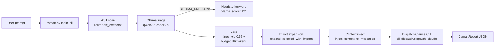
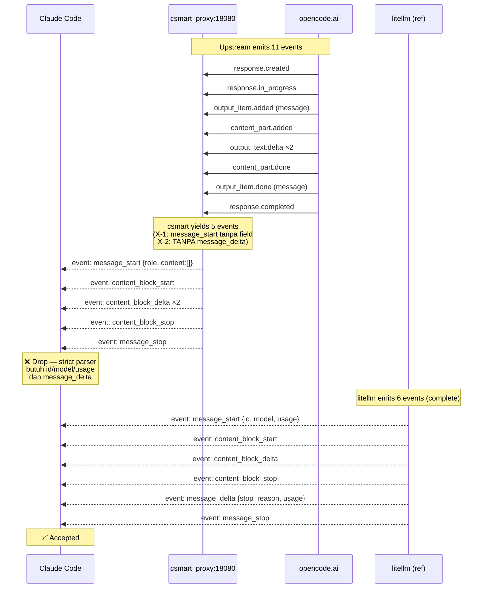

# csmart Pipeline — Diagram & Checklist

> Source: `csmart_proxy.py` (standalone v3, jalan di `127.0.0.1:8080`) + `router/` (CLI mode)
> Upstream aktif: `https://opencode.ai/zen/go/v1` — **3 endpoint** (`/responses`, `/chat/completions`, `/messages`) untuk full 33-model set OpenCode Go
> Bukti: `~/.csmart/logs/session_20260830.jsonl` (full model matrix 200: gpt-5.6-luna, minimax-m3, qwen3.8-flash, glm-5.3-flash, deepseek-chat)
> Update terakhir: 2026-08-30

**Terminologi:**
- **Pipeline bottleneck** = stage yang **missing / broken / blocking downstream** (functional gap)
- **Performance bottleneck** (latency p95, model round-trip) → di-defer ke doc terpisah, bukan di sini

---

## 1. Pipeline Overview (mermaid)

```mermaid
flowchart LR
    Client["Claude Code<br/>(Anthropic /v1/messages)"]:::client

    subgraph Proxy["csmart_proxy.py : 127.0.0.1:18080"]
        direction TB
        IN["1. INBOUND<br/>handle_messages :1721<br/><b>X: 0 middleware</b><br/>loopback/rate-limit/body-cap MISSING"]:::gap
        SJ["2. JSON parse + sanitize<br/>sanitize_payload :517<br/><b>X: silent</b>"]:::gap
        OD["3. OpenAI detect<br/>is_openai_model :706"]:::ok
        RT["4. Tier route<br/>route_model_tier :680"]:::ok
        ST["5. Steering inject<br/>:1766 (OpenAI only)"]:::ok
        PA["6. Prefix align-3-region<br/>align_prefix_3_region :621"]:::ok
        TX["7. Request transform<br/>transform_anthropic_to_openai_responses :901"]:::ok

        UP["8. Upstream call<br/>_sse_source :1307<br/><b>X: no retry HTTP status</b><br/><b>X: no first-chunk error buffer</b>"]:::gap

        RX["9. SSE parse<br/>_iter_sse_events :1281"]:::ok
        SXT["10. Response transform<br/>transform_openai_responses_sse_to_anthropic :1055<br/><b>X: message_start tanpa id/model/usage</b><br/><b>X: TANPA message_delta</b>"]:::gap
        RD["11. StreamingRedactor<br/>unmask __CSMART_SEC_* :1223"]:::ok
        SR["12. StreamingResponse<br/>text/event-stream :1925"]:::ok
    end

    Upstream["opencode.ai/zen/go/v1<br/>muse-spark-1.2-contributor"]:::upstream

    Client -->|POST /v1/messages| IN
    IN --> SJ --> OD --> RT --> ST --> PA --> TX --> UP
    UP <-->|SSE events| Upstream
    UP --> RX --> SXT --> RD --> SR --> Client

    classDef client fill:#e1f5ff,stroke:#0277bd
    classDef ok fill:#e8f5e9,stroke:#2e7d32
    classDef gap fill:#fff3e0,stroke:#e65100
    classDef upstream fill:#f3e5f5,stroke:#6a1b9a
```

**Legenda:**
- 🟢 `ok` — implemented, test pass
- 🟠 `X gap` — stage ada tapi **functional gap** (pecah, missing, atau block downstream)
- 🟣 `upstream` — di luar scope csmart

---

## 2. Stage-by-Stage Checklist (proxy path)

| # | Stage | File:line | Status | Pipeline gap (X) | Bukti |
|---|-------|-----------|--------|-----------------|-------|
| **1** | **INBOUND** receive | `csmart_proxy.py:1721` | 🟠 X | 0 middleware (loopback/rate-limit/body-cap) | `dispatcher.py:876` punya, **tidak di-port** ke csmart_proxy |
| **2** | JSON parse + **DLP sanitize** | `:1726, :517` | 🟠 X | silent — tidak emit log event | `sanitize_payload` return None, counter tidak dikirim |
| **3** | Model detect | `:812, :821` | 🟢 ok | — | 3-way: `is_openai` (chat/responses) vs `is_anthropic_native` (minimax/qwen → passthrough `/messages`) vs regular Anthropic (DeepSeek) |
| **4** | **Tier route** flash/flagship | `:780` | 🟢 ok | — | Heuristic keyword → flash/flagship; **native model dipertahankan** (skip FLASH rewrite) |
| **5** | **Steering inject** (OpenAI only) | `:1766-1784` | 🟢 ok | — | Append `SYSTEM_STEERING_PROMPT` ke `body.system` |
| **6** | **3-region prefix align** | `:621` | 🟢 ok | — | Cache stability untuk KV-cache hit di upstream |
| **7** | **Request transform** Anthropic→Responses | `:901` | 🟢 ok | — | `OPENAI_REQUEST_TRANSFORM` log: `upstream_url:opencode.ai/zen/go/v1/responses` |
| **8** | **Upstream call** `httpx.stream` | `:1307` | 🟠 X | retry HTTP 429/5xx **TIDAK ADA**; first-chunk error **TIDAK ADA** | litellm `num_retries` + `create_response:652` pattern missing |
| **9** | SSE parse OpenAI Responses | `:1281` | 🟢 ok | — | 11 events masuk: `response.created:1, response.output_text.delta:2, response.completed:1` |
| **10** | **Response transform** Responses→Anthropic | `:1055` | 🟠 X | `message_start` tanpa `id/model/usage`; **TANPA `message_delta`** | Issue #4: litellm `fake_stream_iterator.py:153` adopsi 6-event sequence |
| **11** | **StreamingRedactor** unmask secret | `:1223` | 🟢 ok | — | Buffer 64-char tail, split-marker-safe, `vault.unmask_text` |
| **12** | **StreamingResponse** | `:1925` | 🟢 ok | — | `media_type=text/event-stream`, `X-Accel-Buffering: no` |
| **—** | **Health endpoint** | — | 🟠 X | **TIDAK ADA** route | `check_upstream_health`/`check_ollama_health` di `dispatcher.py:1184/1208` tidak di-expose HTTP |
| **—** | **Cost tracking** | — | 🟠 X | **TIDAK ADA** spend log | Tidak ada `usage → $` mapping atau budget per key |
| **—** | **First-chunk error → JSON** | — | 🟠 X | error dibungkus `200 SSE` | `event: error` di-yield dalam 200 — Claude Code expect JSON untuk 4xx |
| **—** | **Model fallback chain** | — | 🟠 X | mati total kalau `muse-spark` down | Tidak ada `fallbacks: [...]` list |
| **—** | **Auth/credential check** | — | 🟠 X | 0 validasi (loopback-only via bind) | `ANTHROPIC_API_KEY` tidak divalidasi (lihat diskusi sebelumnya) |

---

## 3. Pipeline Gaps — Priority (X marks the spot)

| X | Lokasi | Functional gap | Blokir apa? | Fix priority | Effort |
|---|--------|----------------|-------------|--------------|--------|
| **X-1** | `:1055` response transform | `message_start` tanpa `id/model/usage` | Claude Code drop stream | **P0** | ~20 baris |
| **X-2** | `:1055` response transform | `message_delta` TIDAK di-emit | Claude Code anggap incomplete | **P0** | ~15 baris |
| **X-3** | `:1307` upstream call | Retry HTTP 429/5xx TIDAK ADA | Transient error → fail total | **P0** | ~40 baris |
| **X-4** | `:1307` upstream call | First-chunk error buffer TIDAK ADA | 4xx dibungkus 200 SSE | **P1** | ~25 baris |
| **X-5** | `csmart_proxy.py` global | 0 middleware (loopback/rate-limit/body-cap) | Tidak ada security guard di proxy yang jalan | **P0** | port `dispatcher.py:876` (~60 baris) |
| **X-6** | `csmart_proxy.py` global | Health endpoint TIDAK ADA | Tidak bisa probe status | **P1** | ~20 baris |
| **X-7** | `:680` tier route | Model fallback TIDAK ADA | Single point of failure | **P1** | ~30 baris |
| **X-8** | `:517` sanitize | Silent — tidak log berapa secret di-mask | Audit gap | **P2** | ~10 baris |
| **X-9** | global | Cost tracking TIDAK ADA | Tidak ada spend visibility | **P2** | ~50 baris |
| **X-10** | global | Credential validation TIDAK ADA | Mitigated by loopback bind only | **P2** | depends on #X-5 |

**Total:** 10 functional gap. **P0 = 4** (X-1, X-2, X-3, X-5), P1 = 3, P2 = 3.

---

## 4. CLI Mode Pipeline (router/* — `csmart` CLI)

Berlaku saat pakai `csmart "task"` (bukan lewat proxy):

| # | Stage | File:line | Status | Pipeline gap (X) | Bukti |
|---|-------|-----------|--------|-----------------|-------|
| **A** | AST scan | `router/ast_extractor.py` | 🟢 ok | — | `ast_scan_ms: 140` |
| **B** | **Ollama triage** | `router/ollama_scorer.py` | 🟢 ok | — | `triage_model` returns `qwen2.5-coder:7b` |
| **C** | Heuristic fallback | `:121` | 🟢 ok | — | `OLLAMA_FALLBACK` event |
| **D** | Gate | `router/gate.py:24` | 🟢 ok | — | Threshold 0.65 + 16k token budget |
| **E** | Import expansion | `router/dispatcher.py:419` | 🟢 ok | — | Include imports dari selected files |
| **F** | Context inject | `:227` | 🟢 ok | — | Build messages + system dengan context |
| **G** | Claude CLI dispatch | `router/cli_dispatch.py:67` | 🟢 ok | — | Subprocess `claude --print` |

CLI mode: **0 functional gap** di pipeline utama. Semua stage punya event log.

---

## 5. SSE Event Sequence (Issue #4 — evidence)

**Functional gap bukti:** 11 upstream events → 5 csmart events → drop. litellm (reference) emits 6 events dengan field lengkap → accepted.

---

## 6. Cross-reference: issue & doc

| ID | Topik | Status |
|----|-------|--------|
| Issue #1 | Progress csmart v2.1.0 | [closed] |
| Issue #2 | Perf: Qwen triage bottleneck | open (deferred — bukan functional gap, pindah ke `arsitektur/perf/`) |
| Issue #3 | v3 standalone optimizer proxy | open |
| **Issue #4** | **SSE stream tidak masuk Claude Code** | open — X-1, X-2 |
| (internal) | middleware gap di csmart_proxy | X-5 |
| (internal) | retry + first-chunk buffer | X-3, X-4 |
| `csmart-vs-litellm` | analisis komparatif (analisa, bukan implementasi) | done |
| `csmart-lite-comparison.md` | perbandingan fork partner (trivnv-at/csmart-lite) — gap dua arah K1-K10 + C1-C3 | done — adopsi K1/K2/K2b/K3/K5/K6/K7/K10 **committed** (2026-08-30) |

**Catatan:** performance metric (Ollama 12.2s, upstream p95 5.99s) **di-defer** ke `arsitektur/perf/` (belum dibuat) — bukan pipeline gap.
